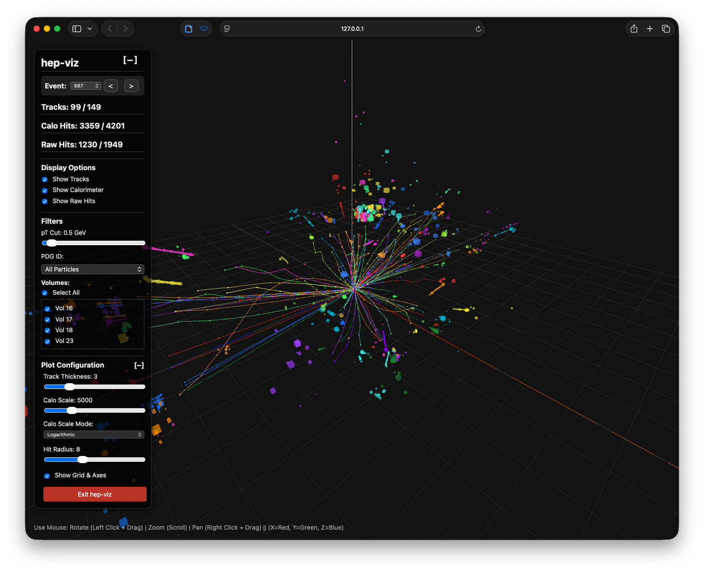

# hep-viz

**A local visualizer for High Energy Physics (HEP) data.**

`hep-viz` is a lightweight, high-performance tool designed to visualize high-dimensional particle tracking and calorimeter data directly from your local machine or Python environment. It bridges the gap between massive local datasets and fluid web-based visualization.

## Features

*   **🚀 Local & Fast**: Runs a local web server to stream data on demand—no cloud upload required.
*   **🐍 Python API**: Seamlessly integrates with Jupyter Notebooks and Python scripts.
*   **💻 CLI Support**: Quickly visualize datasets from your terminal.
*   **✨ 3D Visualization**: Interactive 3D view of particles, tracks, and calorimeter hits.
*   **📂 Parquet Support**: Optimized for reading large datasets stored in Parquet format.

## Installation

Requires Python 3.8+.

### Option 1: Install from PyPI 

```bash
pip install hep-viz
```

### Option 2: Install from Conda

```bash
conda install finnbarwilson::hep-viz
```

### Option 3: Install from Source

```bash
git clone https://github.com/FinnbarWilson/hep-viz.git
cd hep-viz
pip install .
```

## Usage

### 1. Command Line Interface (CLI)

Visualize a directory containing your Parquet data files:

```bash
hep-viz view /path/to/data/directory
```

**Options:**
*   `--port <int>`: Specify the port to run the server on (default: `8000`).
*   `--no-browser`: Prevent the browser from opening automatically.

### 2. Python API

Use `hep-viz` directly within your Python scripts or Jupyter Notebooks. This is perfect for visualizing in-memory data (e.g., from Hugging Face Datasets).

**Example with Hugging Face Datasets:**

```python
import hep_viz
from datasets import load_dataset

# Load a compatible dataset (e.g., OpenDataDetector)
dataset = load_dataset("OpenDataDetector/ColliderML_higgs_pu0")

# Launches the server and opens the visualization
hep_viz.view(dataset)
```

**Example with Custom Dictionary:**

```python
import hep_viz

# Data should be a dictionary of lists
data = {
    "particles": [...],
    "tracks": [...],
    "tracker_hits": [...],
    "calo_hits": [...]
}

hep_viz.view(data)
```

### 3. The Application



Once the server starts, `hep-viz` opens an interactive 3D visualization in your browser. The interface displays:

*   **Particle Tracks**: Trajectories of particles with a pt cut filter
*   **Calorimeter Hits**: Energy deposits shown as cubes, sized by energy contribution.
*   **Tracker Hits**: Individual detector measurements forming the reconstructed tracks.
*   **Interactive Controls**: Rotate, zoom, and pan to explore the event from any angle.
*   **Event Navigation**: Browse through multiple events in your dataset using the event selector.


## Data Format

`hep-viz` expects data to be organized into four main categories. If using the CLI, these should be Parquet files in your target directory. If using the Python API, these should be keys in your dictionary.

### Required Categories

1.  **`particles`**: Truth-level particle information.
    *   *Columns*: `event_id`, `particle_id`, `pdg_id`, `px`, `py`, `vx`, `vy`
2.  **`tracks`**: Reconstructed track information (optional, or derived from hits).
    *   *Columns*: `event_id`, `hit_ids`, `majority_particle_id`, `track_id`
3.  **`tracker_hits`**: Individual hits in the tracker layers.
    *   *Columns*: `event_id`, `particle_id`, `x`, `y`, `z`, `volume_id`
4.  **`calo_hits`**: Energy deposits in the calorimeter.
    *   *Columns*: `event_id`, `x`, `y`, `z`, `contrib_particle_ids` (list), `contrib_energies` (list)

### File Naming (CLI)
For the CLI to automatically detect files, they should contain the category name (e.g., `my_particles.parquet`). You can split data across multiple files using the pattern `events<start>-<end>` (e.g., `particles.events0-999.parquet`).

## Development

To contribute or modify `hep-viz`:

1.  **Clone the repository**:
    ```bash
    git clone https://github.com/yourusername/hep-viz.git
    cd hep-viz
    ```

2.  **Install in editable mode**:
    ```bash
    pip install -e .
    ```

3.  **Run Tests**:
    ```bash
    # Install test dependencies
    pip install pytest httpx
    
    # Run the test suite
    pytest
    ```

## License

This project is licensed under the [MIT License](LICENSE).

Copyright (c) 2025 Finnbar Wilson
